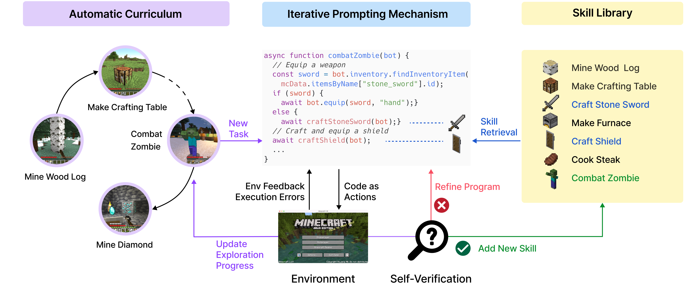
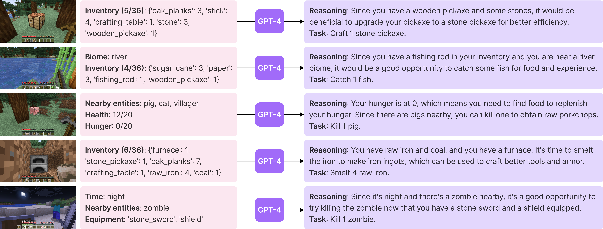
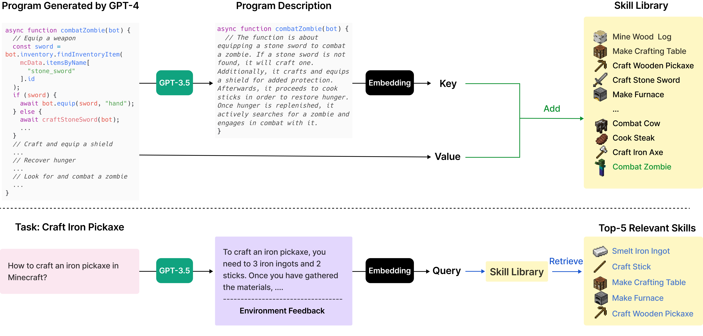
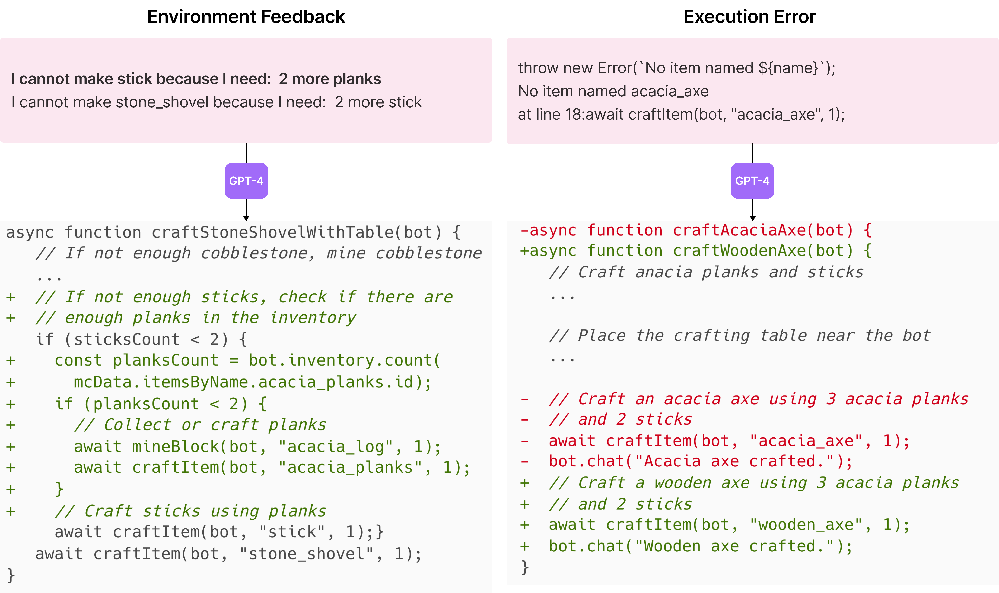
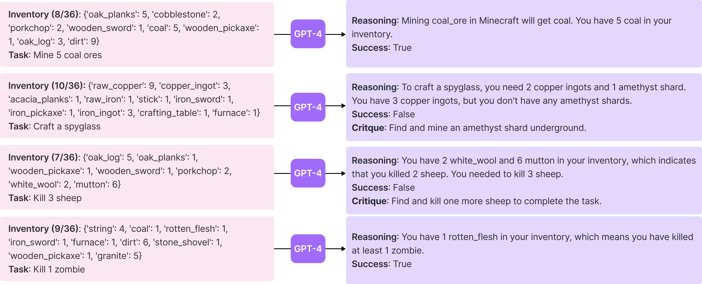

# Voyager, and what steambench took from it

Source: <https://voyager.minedojo.org/> · Wang, Xie, Jiang, Mandlekar, Xiao, Zhu,
Fan, Anandkumar, *Voyager: An Open-Ended Embodied Agent with Large Language
Models*, arXiv:2305.16291 (NVIDIA / Caltech / UT Austin / Stanford / ASU).
Figures retrieved 2026-09-07 and kept here for reference; they are the authors'.

## The three components

An automatic curriculum proposes the next task, an iterative prompting mechanism
turns it into code and refines that code against feedback, and a skill library
stores what worked so later tasks can build on it. The loop closes through
self-verification, which decides whether the task was actually done.

### Automatic curriculum

GPT-4 is shown the agent's state — inventory, biome, nearby entities, health —
and proposes the next task with its reasoning. The prompt also carries
*previously completed and failed tasks*, which is what keeps the frontier
moving: "in-context novelty search". Ablation: replacing it with a random
curriculum costs **93%** of discovered items.

### Skill library

Top: a verified skill is added, keyed by the embedding of a generated
description of it. Bottom: a new task is turned into a query and the top-5
relevant skills are retrieved into the prompt. Without the library, performance
plateaus in later stages, because nothing compounds.

### Iterative prompting

Two of the three feedback types: environment feedback ("I need 2 more planks")
and interpreter errors ("no item named acacia_axe"). Both are put back in the
prompt and the program is rewritten. Up to four rounds; then the curriculum is
asked for a different task.

### Self-verification

A *separate* GPT-4 instance acts as critic: given state and task, it answers
success or failure, and on failure adds a critique saying what to do instead.
Ablation: removing it costs **73%** of discovered items — the largest single
feedback contribution.

## What steambench adopted, and what it did not

| Voyager | steambench (Slay the Spire 2) |
|---|---|
| Automatic curriculum over an open world | `client/astra/curriculum.mjs` + `curriculum.txt`. Objectives are proposed from the live run and the frontier of completed/failed objectives, and the ladder lives in the skill library so it is **inherited across rooms**, not restarted. |
| Critic answers success / failure | `critic.txt` answers success / failure / **pending**. Voyager's tasks are one program execution; an objective here spans dozens of decisions, so "not yet" is the normal honest answer and a premature success is worse than a slow one. |
| Skills = executable code, retrieved by embedding | Notes stay Markdown, retrieved by `client/astra/retrieval.mjs` on the **structured game state**. The mod already names the enemy, event, screen, character and ascension, so key matching is cheaper, deterministic and more precise here than cosine similarity over prose. No second provider, no vector store. |
| Refine a failed program up to 4 rounds | Up to 3 rounds, but only for plans rejected **before any input reached the game**. Voyager's environment is a sandbox it can retry freely; this one is a real game under supervision, so the first-error pause still holds the moment the pad is touched. |
| Objective: "discover as many diverse things as possible" | The game supplies the goal. The curriculum decides what a stretch of play should *establish* — an intent cycle, an event's outcomes, an archetype — so that the run leaves a note behind. |

Not adopted: code as the action space (the action space here is a validated JSON
plan the executor verifies step by step, which is what makes supervision
possible), and the exploration/tech-tree/map-coverage benchmarks, which have no
analogue in a roguelike deckbuilder with a fixed progression.
